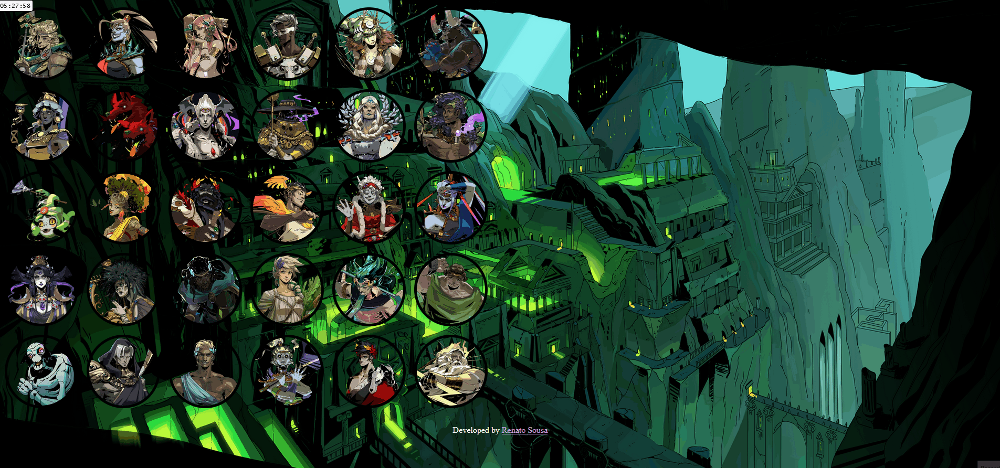

# Hades - Select Your Character

**Link:** https://notare.github.io/hades-select-your-character

[Description in English](#description-in-english)

[Descrição em Português](#descrição-em-português)

# Description in English

This project was created to capture the charm and appeal of the characters in Hades, providing users with an engaging and visually pleasing experience. Whether you're a fan of Greek mythology or just curious to explore the characters, this web app offers a fun way to interact with the game's cast.

## How It's Made:

**Tech used:** HTML, CSS, JavaScript

I wanted to bring to life an immersive character selection experience inspired by the Hades game. While my frontend development expertise might not be extensive yet, my passion for creating captivating user interactions fueled every step of this project's creation.

The structure of the web app was established using HTML. I organized the content into sections: one for character selection and another for displaying detailed character information. Each character is represented with a unique class and data attribute.

The visual aspects of the project were crafted with CSS. I leveraged CSS Flexbox for the layout, ensuring responsive design across various devices. I implemented custom styling for the character buttons, including hover effects and selection highlighting. Additionally, I used Google Fonts to apply a unique typography style to the project.

The interactive aspect of the web app was brought to life using JavaScript. I added event listeners to the character selection section, allowing users to click on characters and see their information displayed on the right side. This included updating the character's image, name, and playing associated audio. I aimed for a seamless user experience by managing the audio playback and resetting the selection state when a new character is chosen.

This project has allowed me to showcase my dedication to creating engaging and user-centric web experiences. The process has also ignited a desire to further enhance my skills in frontend development and design.

## Optimizations

I recognized the importance of not only achieving a visually appealing result but also ensuring efficient functionality. This mindset drove me to implement several optimizations that enhanced the user experience and performance of the web app.

One notable optimization was the handling of audio playback. When a user selects a character, I ensured that the associated audio for the previous character is stopped, preventing any overlapping sounds. This not only maintains a pleasant auditory experience but also contributes to the overall cleanliness of the interaction.

To reinforce the sense of engagement, I incorporated a hover effect and border styling on the currently selected character. This subtle yet effective touch not only guides users but also adds a layer of interactivity that aligns with modern design standards.

While I successfully accomplished these optimizations, I acknowledge that there's always room for improvement. Given more time, I would focus on refining the image size of selected characters. Since the original image sizes are not standardized, I envision implementing a consistent image enlargement on selection to provide users with a clearer and more detailed view of their chosen character.

These optimizations underscore my commitment to delivering not just functional products, but ones that prioritize user satisfaction and engagement. They also reflect my drive to continuously learn and implement best practices for a more polished and efficient user experience.

## Lessons Learned:

One key takeaway is the significance of meticulous planning in frontend development. Starting with a well-structured layout and carefully designed interactions sets the foundation for a successful project. The importance of attention to detail in HTML, CSS, and JavaScript cannot be overstated, as it directly impacts the user experience and overall functionality.

Additionally, I learned the value of optimization. Recognizing areas for improvement and implementing solutions, such as refining audio playback and enhancing user feedback, demonstrated the transformative power of fine-tuning even small aspects of a project.

This endeavor has left me even more committed to embracing challenges and continuously expanding my skills. The satisfaction of delivering an engaging, polished product underscore my passion for frontend development and the exciting path of growth it offers.

## Other Projects:

**Top Brother Rocha (MMA center):** https://github.com/Notare/top-brother-rocha

**Bia Cabeleireira (hair salon):** https://github.com/Notare/bia-cabeleireira

**Bar do Léo (bar and restaurant):** https://github.com/Notare/bar-do-leo

# Descrição em Português

Este projeto foi criado para capturar o charme e o apelo dos personagens de Hades, proporcionando aos usuários uma experiência envolvente e visualmente agradável. Seja você um fã da mitologia grega ou apenas curioso para explorar os personagens, este aplicativo web oferece uma maneira divertida de interagir com o elenco do jogo.

## Como Foi Feito:

**Tecnologias usadas:** HTML, CSS, JavaScript

Quis trazer à vida uma experiência imersiva de seleção de personagens inspirada no jogo Hades. Minha paixão por criar interações cativantes guiou cada etapa da criação deste projeto.

A estrutura do aplicativo web foi criada usando HTML. Organizei o conteúdo em seções: uma para a seleção de personagens e outra para exibir informações detalhadas sobre eles. Cada personagem foi representado com uma classe única e um atributo de dados.

Os aspectos visuais do projeto foram elaborados com CSS. Usei o Flexbox para o layout, garantindo um design responsivo. Estilizei os botões de personagens com efeitos de hover e destaque na seleção. Além disso, utilizei o Google Fonts para aplicar uma tipografia única ao projeto.

A interatividade do aplicativo foi desenvolvida com JavaScript. Adicionei listeners na seção de seleção de personagens, permitindo que os usuários cliquem nos personagens e vejam suas informações exibidas no lado direito. Isso incluiu atualizar a imagem do personagem, seu nome e tocar o áudio associado. Busquei uma experiência fluida, gerenciando a reprodução do áudio e redefinindo o estado da seleção ao escolher um novo personagem.

Este projeto me permitiu demonstrar minha dedicação em criar experiências web envolventes e centradas no usuário. O processo também despertou meu desejo de aprimorar ainda mais minhas habilidades em desenvolvimento e design frontend.

## Otimizações

Reconheci a importância de não apenas alcançar um resultado visualmente atraente, mas também garantir uma funcionalidade eficiente. Esse mindset me levou a implementar várias otimizações que melhoraram a experiência do usuário e o desempenho do aplicativo web.

Uma otimização notável foi o gerenciamento da reprodução de áudio. Quando um usuário seleciona um personagem, certifiquei-me de que o áudio associado ao personagem anterior fosse interrompido, evitando sobreposições de som. Isso não apenas mantém uma experiência auditiva agradável, mas também contribui para a limpeza geral da interação.

Para reforçar o senso de engajamento, incorporei um efeito de hover e um estilo de borda no personagem atualmente selecionado. Esse toque sutil, mas eficaz, não apenas guia os usuários, mas também adiciona uma camada de interatividade alinhada aos padrões modernos de design.

Embora tenha alcançado essas otimizações com sucesso, reconheço que sempre há espaço para melhorias. Com mais tempo, eu focaria em padronizar o tamanho das imagens dos personagens selecionados. Como os tamanhos originais das imagens não são uniformes, imagino implementar um aumento consistente na seleção para oferecer aos usuários uma visão mais clara e detalhada do personagem escolhido.

Essas otimizações refletem meu compromisso em entregar produtos que priorizam a satisfação e o engajamento do usuário. Elas também demonstram minha vontade de aprender continuamente e implementar as melhores práticas para uma experiência mais refinada e eficiente.

## Lições Aprendidas:

Uma lição importante foi a relevância do planejamento cuidadoso no desenvolvimento frontend. Começar com um layout bem estruturado e interações cuidadosamente projetadas estabelece a base para um projeto bem-sucedido. A atenção aos detalhes em HTML, CSS e JavaScript é fundamental, pois impacta diretamente a experiência do usuário e a funcionalidade geral.

Além disso, aprendi o valor da otimização. Reconhecer áreas para melhoria e implementar soluções, como refinar a reprodução de áudio e aprimorar o feedback do usuário, mostrou o poder transformador de ajustar até os menores aspectos de um projeto.

Este esforço me deixou ainda mais comprometido a abraçar desafios e expandir continuamente minhas habilidades. A satisfação de entregar um produto envolvente e polido reforça minha paixão pelo desenvolvimento frontend e o caminho empolgante de crescimento que ele oferece.

## Outros Projetos:

**Top Brother Rocha (centro de MMA):** https://github.com/Notare/top-brother-rocha

**Bia Cabeleireira (salão de beleza):** https://github.com/Notare/bia-cabeleireira

**Bar do Léo (bar e restaurante):** https://github.com/Notare/bar-do-leo
